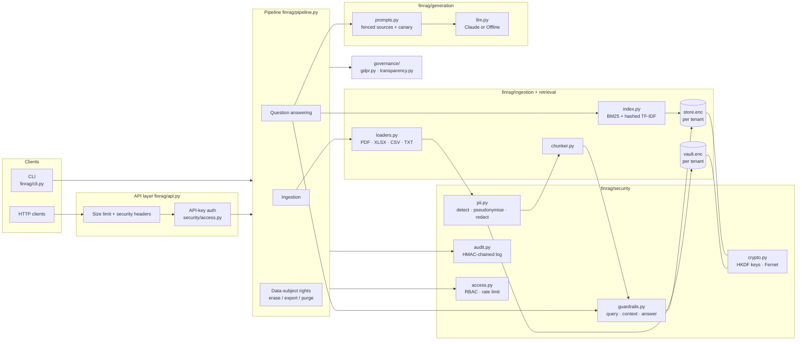
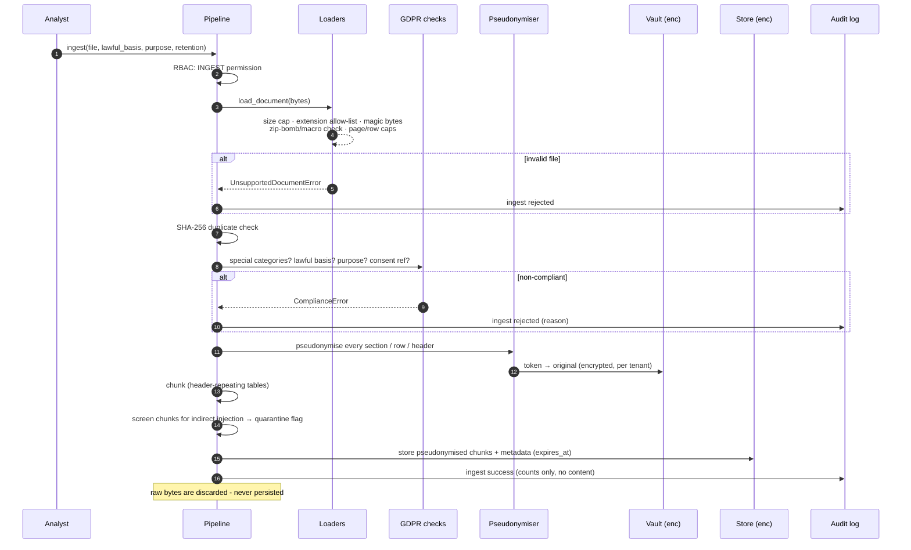
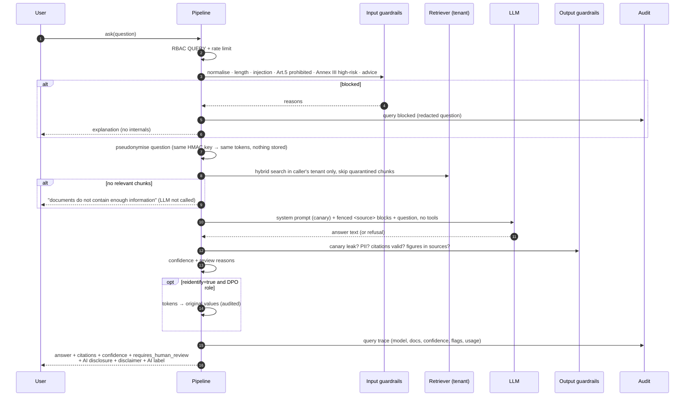
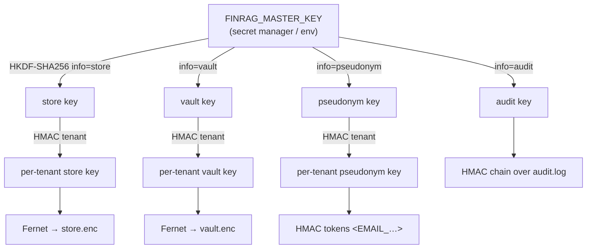

# FinRAG Architecture

This document describes how FinRAG is built, how data flows through it, and where each
security / privacy control sits. For the rule-by-rule mapping to code lines see
[`COMPLIANCE_MATRIX.md`](COMPLIANCE_MATRIX.md); for the reasoning behind the controls see
[`COMPLIANCE.md`](COMPLIANCE.md).

---

## 1. Design goals

| Goal | How it is achieved |
|---|---|
| Accurate answers over financial sheets and reports | Structure-aware parsing (sheets → header-repeated row chunks), hybrid retrieval with finance synonyms, mandatory citations, numeric cross-checking |
| No raw personal data at rest, in logs or sent to an LLM | Keyed pseudonymisation **before** chunking; irreversible redaction in logs; only top-k pseudonymised excerpts leave the host |
| Privacy by default | Offline answer generator by default; finite retention on every document; local retrieval index (no embedding API) |
| Defence in depth against LLM attacks | Input guardrails + context quarantine + fenced prompt + no tools + output guardrails |
| Demonstrable compliance | Tamper-evident audit log; `[RULE: …]` tags in code; generated compliance matrix checked in CI |
| Human in control | Confidence score, `requires_human_review` flag with reasons, high-risk uses blocked |

---

## 2. Component view



### Module responsibilities

| Module | Responsibility |
|---|---|
| `finrag/config.py` | Typed settings from `FINRAG_*` env vars; secrets as `SecretStr`; privacy-protective defaults |
| `finrag/compliance/rules.py` | Registry of every rule ID referenced in code (GDPR, EU AI Act, OWASP LLM, AppSec, PII, FIN) |
| `finrag/security/crypto.py` | Master key → HKDF sub-keys (store, vault, pseudonym, audit); Fernet authenticated encryption; atomic 0600 writes |
| `finrag/security/pii.py` | Checksum-validated PII detection, special-category detection, HMAC tokens, encrypted vault, redaction |
| `finrag/security/guardrails.py` | Prompt-injection / prohibited-use / high-risk detection, context screening, answer validation (canary, PII, citations, figures) |
| `finrag/security/access.py` | Hashed API keys, roles → permissions, token-bucket rate limiter |
| `finrag/security/audit.py` | Append-only HMAC-chained JSONL log with PII scrubbing and verification |
| `finrag/ingestion/loaders.py` | Hostile-input-safe parsing: magic bytes, size/page/row caps, zip-bomb + macro checks, no formula evaluation |
| `finrag/ingestion/chunker.py` | Paragraph chunks with overlap; table chunks that repeat the column header |
| `finrag/retrieval/index.py` | Local hybrid retriever (BM25 60 % + hashed TF-IDF cosine 40 %), finance synonym expansion |
| `finrag/retrieval/store.py` | Per-tenant encrypted document/chunk store, deletion, retention, token overwrite |
| `finrag/generation/prompts.py` | Static system prompt (no secrets, random canary), fenced untrusted sources |
| `finrag/generation/llm.py` | `AnthropicLLM` (Claude via official SDK, adaptive thinking, server-side refusal fallback) and `OfflineLLM` |
| `finrag/governance/gdpr.py` | Lawful basis / purpose / Art. 9 validation, retention deadline, RoPA, privacy notice, safe exports |
| `finrag/governance/transparency.py` | AI disclosure, financial disclaimer, model card, machine-readable AI-output label |
| `finrag/pipeline.py` | Orchestrates everything; the only entry point used by CLI and API |
| `finrag/api.py` | FastAPI server: auth dependency, error mapping, security headers |
| `finrag/cli.py` | Operator CLI (same permission checks as the API) |

---

## 3. Ingestion flow



**What is stored per document:** filename, type, SHA-256, uploader, timestamps,
`expires_at`, lawful basis, purpose, PII counts by type, special-category indicators and
Art. 9(2) condition, number of quarantined chunks. **Never stored:** the raw file, raw
PII in chunks.

### Spreadsheet handling

A sheet like

| Line item | FY2023 | FY2024 |
|---|---|---|
| Revenue | 1,180,000 | 1,452,000 |

becomes chunks of the form

```
Columns: Line item | FY2023 | FY2024
Row 2 | Line item: Revenue | FY2023: 1,180,000.00 | FY2024: 1,452,000.00
```

Each row is self-describing (column → value), so retrieval and the model never confuse
periods or columns, and every chunk repeats the header. Formulas are **not** evaluated
(`data_only=True` returns cached values only).

---

## 4. Question-answering flow



### Confidence score

```
confidence = 0.4 × top retrieval score
           + 0.3 × (answer contains valid citations)
           + 0.3 × (share of figures in the answer found in the sources)
```

`requires_human_review` is true if confidence < `FINRAG_REVIEW_CONFIDENCE_THRESHOLD`
(default 0.55), there are no or invalid citations, any figure is unverified, the user asked
for investment advice, or the answer was truncated.

---

## 5. Key management



* Key separation: compromising one derived key does not reveal the others.
* Tenant separation: the same e-mail gets different tokens in different tenants and data is
  encrypted under different keys.
* Production refuses to start without a master key; development uses an ephemeral key with
  a warning.
* **Rotation:** decrypt with the old key ring and re-encrypt with the new one (offline job);
  pseudonym tokens change on rotation, so rotate the pseudonym key only together with a full
  re-ingest.

---

## 6. Storage layout

```
data/
├── audit/
│   └── audit.log                # HMAC-chained JSONL, 0600, PII-scrubbed
└── tenants/
    └── <tenant>/                # 0700
        ├── store.enc            # Fernet(JSON{documents, chunks})  - pseudonymised only
        └── vault.enc            # Fernet(JSON{token: {type, value, docs}})
```

The in-memory index is rebuilt from `store.enc` on demand. For large corpora, replace
`TenantStore` / `HybridIndex` with a vector database that supports per-tenant collections
and encryption at rest (e.g. pgvector with row-level security); the pipeline interface does
not change.

---

## 7. Trust boundaries

| Boundary | Untrusted input | Controls |
|---|---|---|
| Client → API | headers, JSON, multipart files | TLS at proxy, API-key auth, body size cap, pydantic validation, RBAC, rate limit |
| File → parser | file bytes | extension allow-list, magic bytes, caps, zip-bomb/macro/external-link rejection, encrypted PDFs rejected, strict UTF-8 |
| Document text → prompt | chunk content (attacker-controllable) | quarantine at ingest and query time, `<source>` fencing with tag neutralisation, "data not instructions" system rule |
| Host → LLM provider | pseudonymised excerpts | offline by default; only top-k redacted chunks; no tools; `max_tokens` cap |
| LLM → user | model output | canary check, PII redaction, citation + figure validation, markup stripping, AI label |
| Process → disk | everything persisted | Fernet encryption, atomic 0600 writes, no raw files |

---

## 8. Extending FinRAG

* **New file type:** add a loader to `_LOADERS` in `ingestion/loaders.py` that validates
  the format first, then returns `Section`s.
* **Better PII recall:** pass an NER-based detector (e.g. Presidio) in
  `PIIDetector(extra_detectors=[...])`.
* **Self-hosted embeddings:** implement the same `search()` interface as `HybridIndex`.
* **New rule:** register it in `compliance/rules.py`, tag the implementing lines with
  `[RULE: ID]`, run `python scripts/compliance_report.py`. CI fails if a tag is unknown or
  the matrix is stale.
