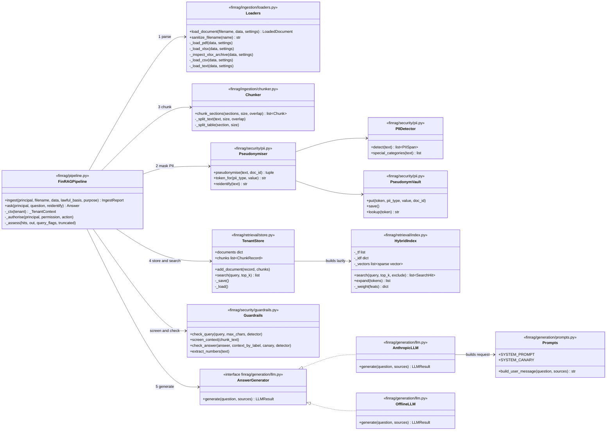
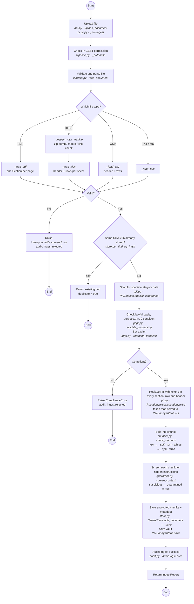
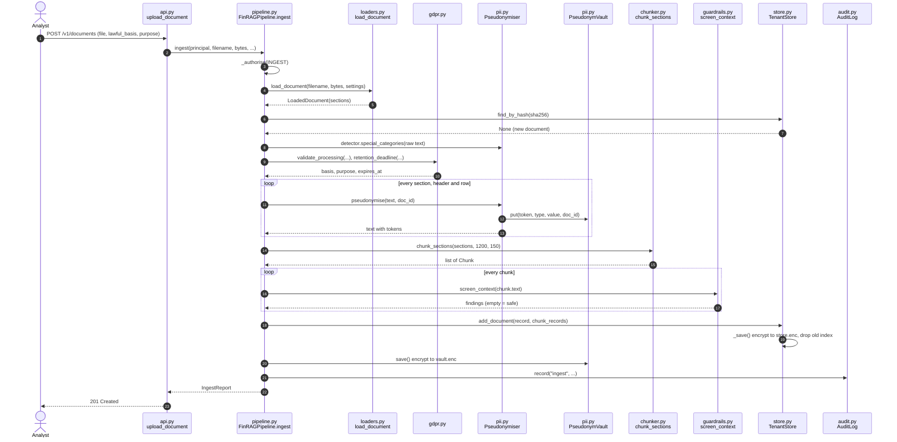
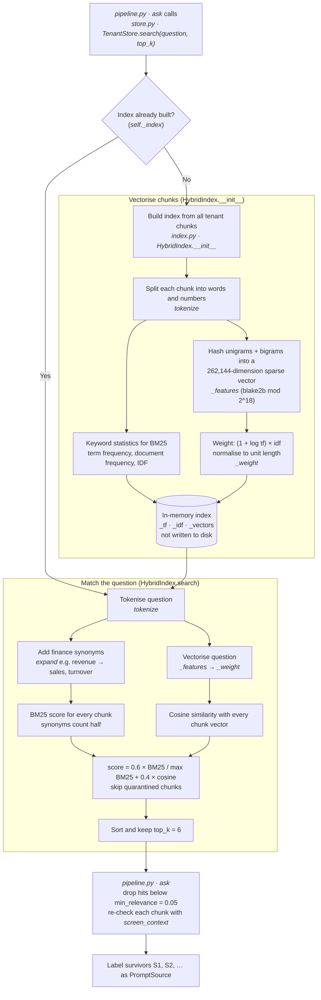
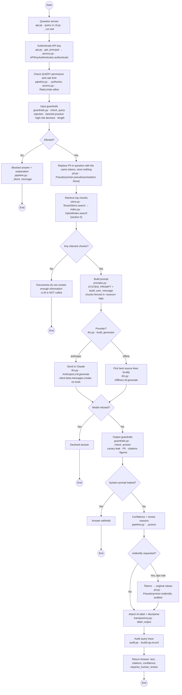
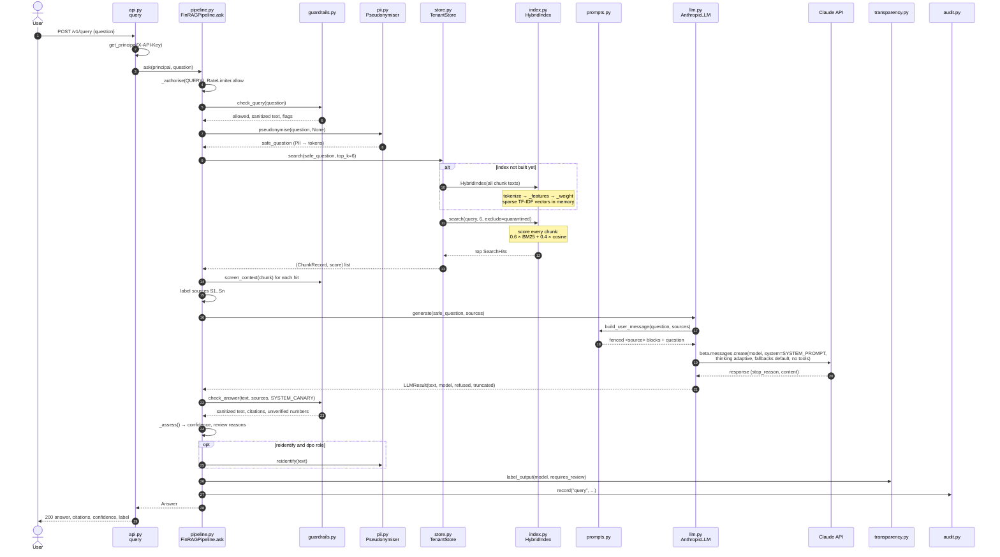
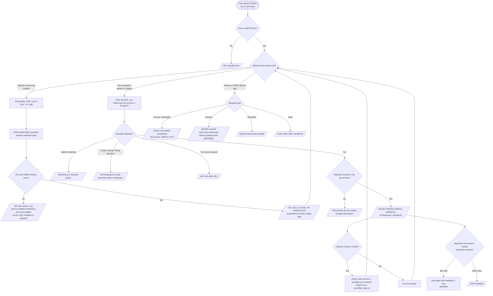
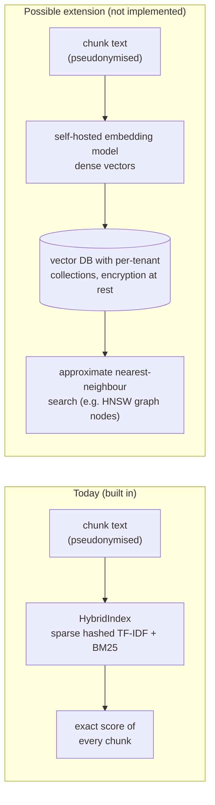

# RAG Flow: UML and User-Flow Diagrams

This page traces every RAG step in FinRAG to the function and file that performs it:
loading, chunking, "embedding" (vectorising), storing, retrieving, sending to the LLM,
and checking the answer.

Diagrams use Mermaid and render directly on GitHub.

- [1. Vector storage and matching: how FinRAG actually does it](#1-vector-storage-and-matching-how-finrag-actually-does-it)
- [2. UML class diagram: the RAG components](#2-uml-class-diagram-the-rag-components)
- [3. UML activity diagram: ingestion (file to stored chunks)](#3-uml-activity-diagram-ingestion-file-to-stored-chunks)
- [4. UML sequence diagram: ingestion](#4-uml-sequence-diagram-ingestion)
- [5. UML activity diagram: vectorising and matching](#5-uml-activity-diagram-vectorising-and-matching)
- [6. UML activity diagram: question to answer](#6-uml-activity-diagram-question-to-answer)
- [7. UML sequence diagram: question to answer (including the LLM call)](#7-uml-sequence-diagram-question-to-answer-including-the-llm-call)
- [8. User flow diagram](#8-user-flow-diagram)
- [9. Function reference](#9-function-reference)
- [10. Swapping in a real vector database](#10-swapping-in-a-real-vector-database)

---

## 1. Vector storage and matching: how FinRAG actually does it

> **FinRAG does not use an external vector database, and it does not match queries to
> clusters or graph nodes.** This is a deliberate privacy choice (GDPR Art. 25 / Art. 44):
> no document text is sent to an embedding API or a hosted vector store.

| Question | Answer in FinRAG |
|---|---|
| Where are chunks stored? | `TenantStore` in `finrag/retrieval/store.py`. One Fernet-encrypted file per tenant: `data/tenants/<tenant>/store.enc`. It holds pseudonymised chunk text and metadata, not vectors. |
| What is the "embedding" step? | `HybridIndex.__init__` in `finrag/retrieval/index.py`. Each chunk is tokenised (`tokenize`), its words and word pairs are hashed into a 262,144-dimension sparse vector (`_features`), weighted by TF-IDF and normalised to unit length (`_weight`). There is no neural embedding model. |
| Where do the vectors live? | In memory only, inside `HybridIndex`. `TenantStore.search` builds the index the first time it is needed and throws it away whenever documents change (`TenantStore._save` sets `_index = None`). Vectors are never written to disk. |
| How is the best match found? | `HybridIndex.search`. **Exact search over every chunk** in the tenant: each chunk gets `0.6 × BM25 keyword score (normalised) + 0.4 × cosine similarity`. Quarantined chunks are skipped. The top `k` (default 6) above `min_relevance` (default 0.05) are kept. |
| Clusters / nodes (IVF, HNSW)? | None. Those are approximate-search structures that large vector databases use to avoid scoring every vector. FinRAG scores every chunk, which is exact and fast enough for thousands of chunks per tenant. |
| When would I need a vector DB? | When a tenant has hundreds of thousands of chunks, or you want neural (meaning-based) embeddings. See [section 10](#10-swapping-in-a-real-vector-database). |

---

## 2. UML class diagram: the RAG components

---

## 3. UML activity diagram: ingestion (file to stored chunks)

No vectors are created at upload time. They are built on the first search after a change
(see section 5).

---

## 4. UML sequence diagram: ingestion

---

## 5. UML activity diagram: vectorising and matching

This is the "embedding" and "vector search" part of the pipeline. Everything happens
inside `finrag/retrieval/index.py` and `finrag/retrieval/store.py`.

There is no cluster or node lookup: step S2/S4 visits every chunk of the tenant.

---

## 6. UML activity diagram: question to answer

---

## 7. UML sequence diagram: question to answer (including the LLM call)

---

## 8. User flow diagram

What each type of user does, and what they see at every decision point.

---

## 9. Function reference

Line numbers are as of this commit and move as the code changes; search for the function
name if they drift.

### Ingestion: file to stored chunks

| # | Step | Function | File |
|---|---|---|---|
| 1 | Receive upload | `upload_document` | `finrag/api.py:167` |
| 2 | Orchestrate ingestion | `FinRAGPipeline.ingest` | `finrag/pipeline.py:170` |
| 3 | Permission check | `FinRAGPipeline._authorise` | `finrag/pipeline.py:159` |
| 4 | Validate + dispatch by type | `load_document` | `finrag/ingestion/loaders.py:229` |
| 4a | PDF pages → sections | `_load_pdf` | `finrag/ingestion/loaders.py:101` |
| 4b | XLSX safety check | `_inspect_xlsx_archive` | `finrag/ingestion/loaders.py:125` |
| 4c | XLSX sheets → header + rows | `_load_xlsx` | `finrag/ingestion/loaders.py:150` |
| 4d | CSV → header + rows | `_load_csv` | `finrag/ingestion/loaders.py:187` |
| 4e | Text / Markdown | `_load_text` | `finrag/ingestion/loaders.py:214` |
| 5 | Duplicate check | `TenantStore.find_by_hash` | `finrag/retrieval/store.py:152` |
| 6 | Special-category scan | `PIIDetector.special_categories` | `finrag/security/pii.py:184` |
| 7 | GDPR checks + expiry | `validate_processing`, `retention_deadline` | `finrag/governance/gdpr.py` |
| 8 | Find PII | `PIIDetector.detect` | `finrag/security/pii.py:158` |
| 9 | Replace PII with tokens | `Pseudonymiser.pseudonymise` | `finrag/security/pii.py:294` |
| 10 | Record token → value | `PseudonymVault.put` / `save` | `finrag/security/pii.py:229`, `:238` |
| 11 | **Split into chunks** | `chunk_sections` | `finrag/ingestion/chunker.py:78` |
| 11a | Paragraph chunks with overlap | `_split_text` | `finrag/ingestion/chunker.py:32` |
| 11b | Table chunks repeating the header | `_split_table` | `finrag/ingestion/chunker.py:61` |
| 12 | Quarantine hidden instructions | `screen_context` | `finrag/security/guardrails.py:159` |
| 13 | Encrypt + save chunks | `TenantStore.add_document` → `_save` | `finrag/retrieval/store.py:113`, `:104` |

### Vectorising and matching

| # | Step | Function | File |
|---|---|---|---|
| 14 | Search entry point, builds index lazily | `TenantStore.search` | `finrag/retrieval/store.py:156` |
| 15 | **Vectorise all chunks** | `HybridIndex.__init__` | `finrag/retrieval/index.py:88` |
| 15a | Words / numbers | `tokenize` | `finrag/retrieval/index.py:60` |
| 15b | Hash into 2^18-dim sparse vector | `_features` | `finrag/retrieval/index.py:70` |
| 15c | TF-IDF weight + unit length | `HybridIndex._weight` | `finrag/retrieval/index.py:108` |
| 16 | Finance synonym expansion | `HybridIndex.expand` | `finrag/retrieval/index.py:115` |
| 17 | **Score every chunk (BM25 + cosine), top k** | `HybridIndex.search` | `finrag/retrieval/index.py:122` |

### Question to answer

| # | Step | Function | File |
|---|---|---|---|
| 18 | Receive question | `query` | `finrag/api.py:206` |
| 19 | Authenticate | `get_principal` → `APIKeyAuthenticator.authenticate` | `finrag/api.py:119`, `finrag/security/access.py` |
| 20 | Orchestrate answering | `FinRAGPipeline.ask` | `finrag/pipeline.py:268` |
| 21 | Input guardrails | `check_query` | `finrag/security/guardrails.py:118` |
| 22 | Mask PII in the question | `Pseudonymiser.pseudonymise(text, None)` | `finrag/security/pii.py:294` |
| 23 | Retrieve (steps 14 to 17) | `TenantStore.search` | `finrag/retrieval/store.py:156` |
| 24 | Choose provider | `build_generator` | `finrag/generation/llm.py:144` |
| 25 | Build prompt | `SYSTEM_PROMPT`, `build_user_message` | `finrag/generation/prompts.py:76` |
| 26 | **Send to LLM** | `AnthropicLLM.generate` (Claude) | `finrag/generation/llm.py:73` |
| 26b | Local alternative | `OfflineLLM.generate` | `finrag/generation/llm.py:119` |
| 27 | Output guardrails | `check_answer` | `finrag/security/guardrails.py:201` |
| 28 | Confidence + review flag | `FinRAGPipeline._assess` | `finrag/pipeline.py:385` |
| 29 | Optional re-identification | `Pseudonymiser.reidentify` | `finrag/security/pii.py:318` |
| 30 | AI label | `label_output` | `finrag/governance/transparency.py` |
| 31 | Audit trace | `AuditLog.record` | `finrag/security/audit.py` |

---

## 10. Swapping in a real vector database

If you need neural embeddings or very large corpora, only `TenantStore.search` and
`HybridIndex` change. The rest of the pipeline (PII masking, guardrails, prompt, LLM,
audit) stays as it is.

Requirements to keep the same guarantees:

- Embed only the **pseudonymised** chunk text, never the raw file.
- Prefer a **self-hosted** embedding model, or put a DPA in place for a hosted one
  (GDPR Art. 28 / 44).
- One collection or namespace per tenant, with the tenant taken from the credential
  (OWASP LLM08).
- Encryption at rest, and delete vectors whenever `delete_document`, `erase_subject` or
  `purge_expired` runs (GDPR Art. 17 / 5(1)(e)).
